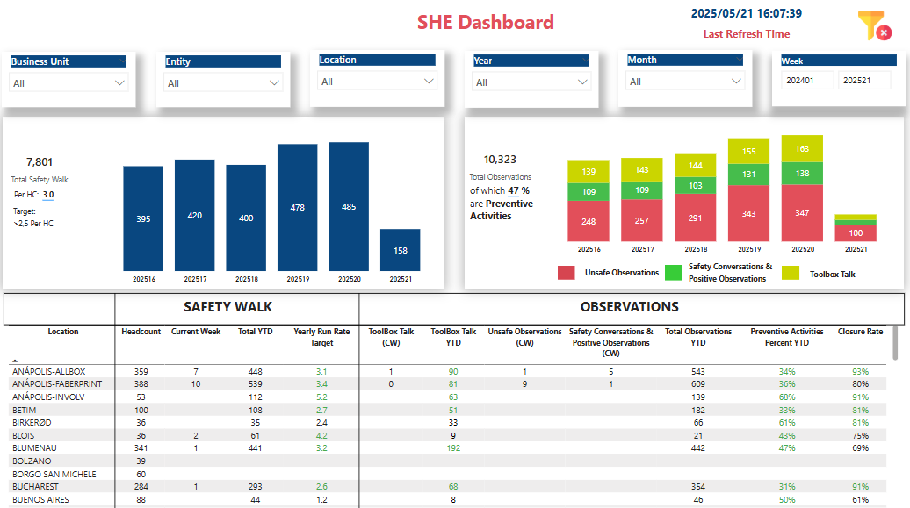
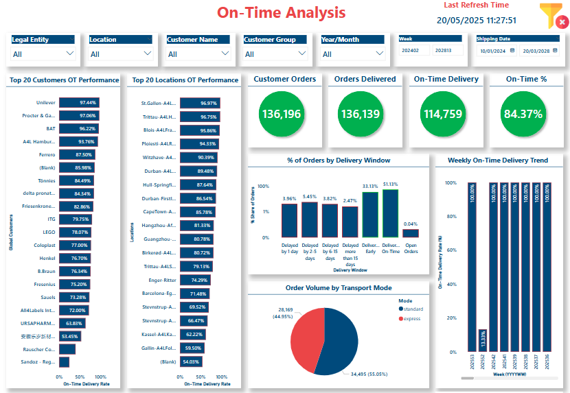
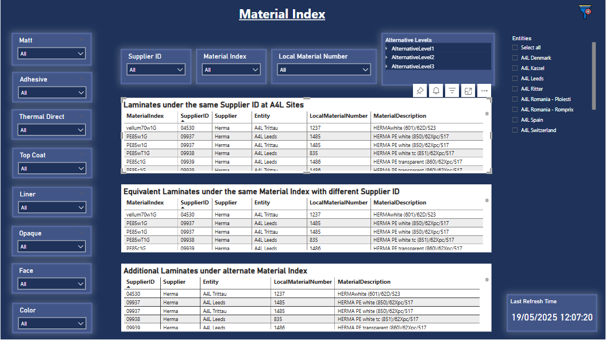

<h1 align="center">Hey 👋 I'm Thanuja Cherukuri</h1>
<h3 align="center">SAP & Power BI Developer • Turning ERP data into insight</h3>

  
  
  

---

### 🚀 About Me
- 🏢  **SAP BI Developer @ All4Labels Group GmbH** (2024-present) – streaming SAP → Datasphere → Power BI for real-time insights
- Ex-researcher at **Infineon Technologies AG** – delivered an adaptive FMCW-radar filter boosting detection accuracy by 80 %
- M.Sc. Information & Communication Systems, **TU Hamburg**  
- 📊  Built **4 production-grade Power BI dashboards** (Sales, Finance, Safety Health & Environment (SHE), Supply Chain Operations) used in 15+ business units across All4Labels
- ⚙️  Passionate about turning messy SAP/non-SAP data into actionable dashboards/reports/stories and automating anything that smells like Excel
-  Living in Hamburg • English (Fluent) • Deutsch (B1)  

### 🛠️ Tech Toolbox
| SAP | Data / BI | Programming | DevOps / Cloud |
|-----|-----------|-------------|----------------|
| S/4HANA (SD, IDoc, CDS), Datasphere | Power BI, SAC, SQL Server | Python, ABAP OO, DAX, SQL | Docker, Git, CI/CD, Azure DL, JIRA |

### 📊 Featured Dashboards

| Year | Dashboard | Screenshot | Business Area | Stack | Impact |
|------|-----------|------------|---------------|-------|--------|
| **2025** | **Customer Performance Monitor** |  | Sales & Finance | SAP Datasphere · Power BI · SQL Server · Azure DL | Real-time KPIs (Turnover, EBITDA, DSO ⋯) – eliminated 80 % Excel churn |
| **2025** | **Safety Performance & Compliance** |  | Global SHE | SAP Datasphere · Power BI · SQL Server · Azure DL | Cut monthly incident-report cycle from 3 days → 30 min |
| **2025** | **Material Procurement & OTD** |  | Supply Chain | SAP Datasphere · Power BI · SQL Server · Azure DL | Raised on-time-delivery visibility & flagged €2 M inventory risks |
| **2024** | **Order-to-Cash (O2C) Performance** |  | Sales & FICO | SAP ERP · SAP Datasphere · Power BI | Live pipeline from S/4HANA to dashboards; 80 % less manual order handling |

### 📚 Learning Journey
- PL-300 · Microsoft Power BI Data Analyst  
- SAP Certified Associate - Data Engineer
- SAP Certified Associate - Back End Developer - ABAP Cloud
  
💬 **Let’s connect & build data-driven SAP solutions together!**

  

---
