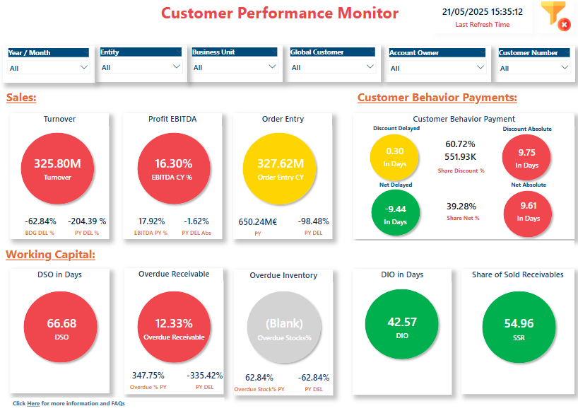

<h1 align="center">Hey 👋 I'm Thanuja Cherukuri</h1>
<h3 align="center">SAP & BI Developer • Turning ERP data into insight</h3>

  
  
  

---

### 🚀 About Me
- 🏢  **SAP BI Developer @ All4Labels Group GmbH, Hamburg** (2024-present) – streaming SAP ERP data → BigQuery & Datasphere modelling → BI solutions for real-time insights
- Completed Master Thesis at **Infineon Technologies AG, Munich** – delivered a python-based adaptive FMCW-radar filter boosting detection accuracy by 80 %
- M.Sc. Information & Communication Systems, **TU Hamburg**  
- 📊  Built **7+ production-grade BI dashboards** (Sales, Finance, Safety Health & Environment (SHE), Supply Chain Operations) used in 15+ business units across All4Labels
- ⚙️  Passionate about turning messy SAP/non-SAP data into actionable dashboards/reports/stories and automating anything that smells like Excel
-  Living in Hamburg • English (Fluent) • Deutsch (B1)  

### 🛠️ Tech Toolbox
| SAP | Data / BI | Programming | DevOps / Cloud |
|-----|-----------|-------------|----------------|
| SAP BW/4HANA, SAP Datasphere | Power BI, Tableau, Looker Studio, SAC, SQL Server | Python, ABAP, DAX, SQL | Docker, Git, CI/CD, Azure DL, Google BigQuery, JIRA, Confluence |

### 📊 Featured Dashboards

| Year | Dashboard | Screenshot | Business Area | Impact |
|------|-----------|------------|---------------|--------|
| **2025** | **Customer Performance Monitor** |  | Sales & Finance | Real-time KPIs (Turnover, EBITDA, DSO ⋯) – eliminated 80 % Excel churn |
| **2025** | **Safety Performance & Compliance** |  | Global SHE | Cut monthly incident-report cycle from 3 days → 30 min |
| **2025** | **On-Time Delivery Analysis** |  | Supply Chain | Raised on-time-delivery visibility & flagged €2 M inventory risks |
| **2024** | **Material Procurement Monitor** |  | Sales & FICO | Live pipeline from S/4HANA to dashboards; 80 % less manual order handling |
| **2024** | **Market Trend Analysis** |   | Market Intelligence & Operations | Forecasted revenue trends, quantified marketing impact, and uncovered top‐performing plans and state‐level shipping efficiencies |

### 📚 Learning Journey
- SAP Certified Associate - Implementation Consultant End-to-End Business Processes for the Intelligent Enterprise
  
💬 **Let’s connect & build data-driven BI solutions together!**

---
